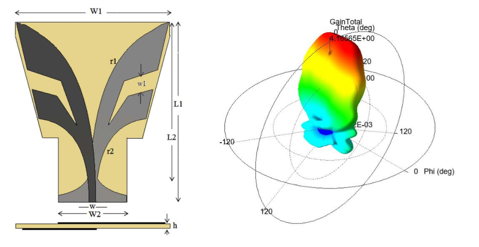

# Electronics and Communications Engineering Senior Student

#### Technical Skills: ns3, Matlab, C/C++ 

## Education			        		
- B.S., Electronics and Communications Engineering | Istanbul Technical University (_June 2025_)

## Experience
**Internship at TÜBITAK BILGEM: 5G Localization Project**
- Integrated a stereo camera-based localization system using YOLO and machine learning models with Intel Realsense depth cameras.
- Connected this system to a beamformer to create a 5G localization solution.

**Internship at NETAS: Analog Automatic Voltage Regulator**
- Worked on a Automatic Analog Voltage Regulator design.
- Examined and made corrections on schematics of the project.
- Conducted the tests of project from computer simulations to physical tests on printed PCBA.

## Projects
### Implementation of Integrated Sensing and Communication (ISAC) Systems Using BPSK on SDR
This study focuses on implementing Integrated Sensing and Communication (ISAC) systems using Binary Phase Shift Keying (BPSK) modulation on a Software Defined Radio (SDR) platform. The primary objectives include designing a robust system for simultaneous communication and ranging functionalities while addressing key challenges such as symbol timing recovery and synchronization in noisy environments.

### Vivaldi Antenna Design Implementation
In this work, purposes and use areas of vivaldi antennas and antipodal vivaldi antennas has 
been covered. An Antipodal vivaldi antenna published in IEEE ANTENNAS AND 
WIRELESS PROPAGATION LETTERS, VOL.14, 2015 [1] has been realized in HFSS 
simulation environment and performance metrics obtained in simulation compared with 
simulation results of authors. Consequently, it is evaluated whether this design serves its 
purposes.  
Vivaldi antenna is a kind of aperture antenna that promises perfect radiation characteristics 
such as high gain, wide band operation and good directive features such as low side lobes. 
Along side of these benefits of vivaldi antenna it is highly applicable and affordable option. 
This antenna type is suggested first by Peter J. Gibson fundamentally and has been developed 
alternative designs for different applications ever since [2,3]. Antipodal vivaldi antennas have 
same benefits as vivaldi antennas. In this context, antipodal expresses each leaf of vivaldi 
antenna is placed opposing sides of the substrate. Antipodal vivaldi antennas have lots of use 
areas as well such as imaging and long range applications [4]. In that study, aim of the 
proposed design is increasing the operating bandwidth by proposed antenna geometry which 
includes shape of recessments on the fins of the antenna and taper rates of the fins inside and 
outside. It is expectected to see a increase in bandwidth by decreasing the lower cutoff 
frequency from 5.2 GHz to approximately 3.7 GHz. 

